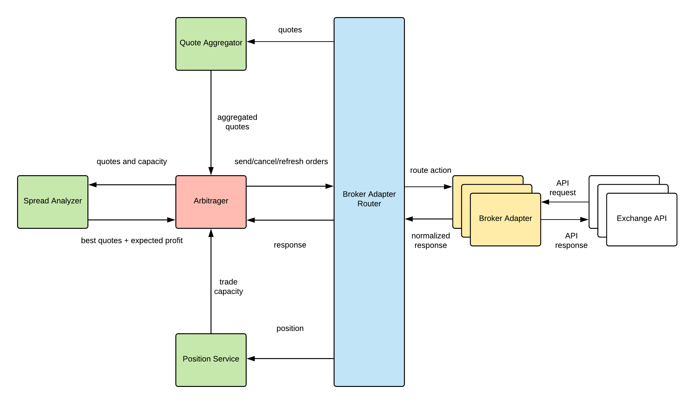

## Glossary:

- **Exchange**. Cryptocurrency exchanges or digital currency exchanges (DCE) are businesses that allow customers to trade cryptocurrencies or digital currencies for other assets, such as conventional fiat money, or different digital currencies
- **Broker**. A crypto assets broker is an agent (Arke) who represents clients to buy or sell crypto assets.
- **Ask price**. The ask price is the lowest price a seller of a crypto assets is willing to accept for a share of that given exchange.
- **Bid price**. The price at which a market-maker or dealer is prepared to buy crypto assets.
- **Quote**. The bid or ask quotes are the most current prices and quantities at which the crypto assets can be bought or sold.
- **Spread**. A bid price is the highest price that a buyer (i.e., bidder) is willing to pay for a good. It is usually referred to simply as the "bid". In bid and ask, the bid price stands in contrast to the ask price or "offer", and the difference between the two is called the bid–ask spread.
- **Position**. Position in a futures contract does not reflect ownership but rather a binding commitment to buy or sell a given number of crypto assets for a given price.
- **Long position**. A long (or long position) is the buying of crypto assets with the expectation that the asset will rise in value.
- **Short Position**. The Short Position is a technique used when an investor anticipates that the value of crypto assets will decrease in the short term, perhaps in the next few days or weeks. In a short sell transaction the investor borrows the crypto assets from the exchange to sell to another investor.
- **Legs**. In spread trade (also known as relative value trade) is the simultaneous purchase of one security and sale of a related security, called legs
- **Arbitrage** is the simultaneous purchase and sale of an asset to profit from a difference in the price. It is a trade that profits by exploiting the price differences of identical or similar financial instruments on different markets or in different forms.
- **Arbitrage opportunity** - difference in quotes on the same asset on different exchanges.

## Arbitrage strategy requirements:

1. The strategy is market-neutral: regardless of market fluctuation return isn't impacted.
2. The strategy doesn't incline to move funds between exchanges.

## How it works:

### Big picture:

A broker analyses the arbitrage opportunities by comparing quotes from exchanges pairs and makes two legs (opens short position on higher quoted exchange, opens long position on lower quoted exchange) on exchanges which have arbitrage opportunity. When arbitrage opportunity ends the broker notifies an investor about the profit.

### Explanation in numbers:

Case 1
Bitstamp BTC@$200.00
Bitfinex BTC@$200.00
No arbitrage opportunity, broker 100% cash, no market risk.
Balance on Bitstamp: 1000.00 USD, 0.0000 BTC
Balance on Bitfinex: 1000.00 USD, 0.0000 BTC

Case 2
Bitstamp BTC@$190.00
Bitfinex BTC@$210.00
Opportunity ($20.00 spread): broker 0% cash, but still no market risk since long/short positions opened.
Balance on Bitstamp: 0.00 USD, 5.2631 BTC (buy for $1000.00)
Balance on Bitfinex: 0.00 USD, -4.7619 BTC (short sell with $1000.00)

Now the Bitcoin market goes down, but the $20.00 spread is present.

Case 3
Bitstamp BTC@$160.00
Bitfinex BTC@$180.00
There is still a spread. No action taken.
Balance on Bitstamp: 0.00 USD, 5.2631 BTC (long)
Balance on Bitfinex: 0.00 USD, -4.7619 BTC (short)

Now the spread closes:

Case 4
Bitstamp BTC@$180.00
Bitfinex BTC@$180.00
Exit opportunity: close the long and short positions.
Balance on Bitstamp: 947.36 USD, 0.0000 BTC
Balance on Bitfinex: 1142.86 USD, 0.0000 BTC

Balance on Bitfinex calculation: $1000 (initial margin) + ($1000 - $857.14 = $142.86) = 1142.86 USD

Net profit: $947.36 + $1142.86 - $2000 = 90.22 USD 

## Architecture requirements:

- add new exchanges as gems
- API calls concurrently sent/handles
- dynamically update configuration

### Architecture Diagram:

### Workflow:

1. Download quotes from exchanges.
2. Filleter out quotes that is not usable for arbitrage.
3. Calculate the best ask and bid and validate the profit to be grater then configured value. If no arbitrage opportunity wait for next iteration.
4. Send buy and sell legs to the exchanges with best price.
5. Check if legs got filled periodically.
6. If filled show profit. If partially filled issue cover order to balance position.
7. If the spread closes or smaller then configured value, close the legs orders.
